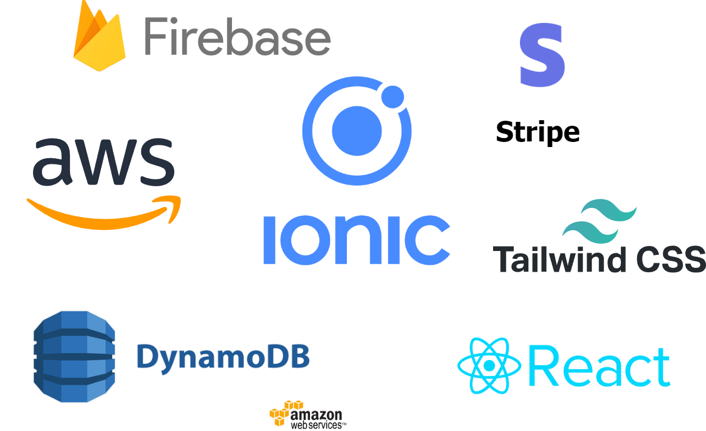

# RapidLaunch: Ionic Template for Web and Mobile Apps

##  Background

RapidLaunch is a versatile, cost-effective template designed to accelerate the development and deployment of web and mobile applications. Built with Ionic 7, React, and Tailwind CSS, it offers a robust front-end framework combined with a powerful backend infrastructure using Node.js, Express, and AWS services. RapidLaunch is inspired by the success of [ShipFast](https://shipfa.st/), providing a reusable template that simplifies the creation and launch of new digital products.

##  Problem Statement

Creating a new web or mobile application from scratch can be a complex and time-consuming process. Developers need to set up both frontend and backend infrastructures, integrate various third-party services, and ensure that everything works seamlessly together. Existing solutions like Next.js and Vercel are often expensive and may not be optimized for mobile app development. 

RapidLaunch addresses these challenges by providing a comprehensive, flexible template that is optimized for both web and mobile applications. It includes out-of-the-box integrations for essential services like analytics, authentication, and payments, reducing the time and effort needed to launch a new product. The template also comes with a step-by-step guide to assist users in customizing and deploying their applications.

##  Solution

The stack for RapidLaunch includes a modern frontend built with Ionic 7, React, Tailwind CSS, and Typescript. The backend is powered by Node.js and Express, with AWS services like DynamoDB and S3 handling data storage and file management. Firebase is used for hosting and authentication, while Stripe manages payments. Google Analytics is integrated for tracking user behavior and performance metrics.

The pipeline is designed to streamline the development process, from setting up the initial project structure to deploying the final product. The template allows for easy customization, enabling developers to tailor the application to their specific needs. Once the project is ready, it can be deployed to Firebase Hosting with a few simple steps. 

It is reducing time spent on re-usable technology and focusing on the core business logic.

## Timeline
<Timeline>
- 2024-08-01: Development of base template
- 2024-08-10 to 2024-09-01: Development of other applications using the template and incorporating process
- 2024-09-01 to 2024-09-20: Documentation and testing
- 2024-09-20: Launch of RapidLaunch template

</Timeline>

## Business Case

RapidLaunch addresses the need for a cost-effective, versatile template that accelerates web and mobile app development. It combines the power of Ionic 7, React, and AWS services to offer a comprehensive solution that's optimized for both web and mobile platforms. By providing out-of-the-box integrations and a step-by-step guide, RapidLaunch significantly reduces development time and costs, allowing developers to focus on core business logic rather than repetitive setup tasks.

### Market

- **Indie Developers**: Solo developers or small teams looking for a quick way to launch MVPs or side projects.
- **Startups**: Early-stage companies needing to rapidly prototype and launch products without significant upfront investment.
- **Agencies**: Web and mobile development agencies seeking to streamline their project workflows and reduce development time.

RapidLaunch is positioned to capture a significant portion of the growing market for rapid application development tools, offering a unique combination of web and mobile optimization at a competitive price point.

## Go-to-Market Strategy

1. **Launch on Product Hunt**: Leverage the platform's tech-savvy audience to gain initial traction and feedback.
2. **Content Marketing**: Create tutorials, case studies, and comparison articles to showcase RapidLaunch's benefits over alternatives.
3. **Developer Community Engagement**: Actively participate in forums like Stack Overflow, Reddit's r/webdev, and Discord communities to provide value and subtly promote RapidLaunch.
4. **Freemium Model**: Offer a free tier with basic features to attract users, with paid tiers for advanced functionality and support.
5. **Affiliate Program**: Incentivize successful users to promote RapidLaunch through an affiliate program.
6. **Targeted Social Media Advertising**: Run campaigns on platforms like LinkedIn and Twitter, focusing on developers and startup founders.
7 **Cold Emailing and Outreach**: Reach out to potential users directly through personalized emails and messages.

This strategy focuses on building awareness within the developer community, showcasing the product's value, and providing multiple entry points for potential users to discover and adopt RapidLaunch.