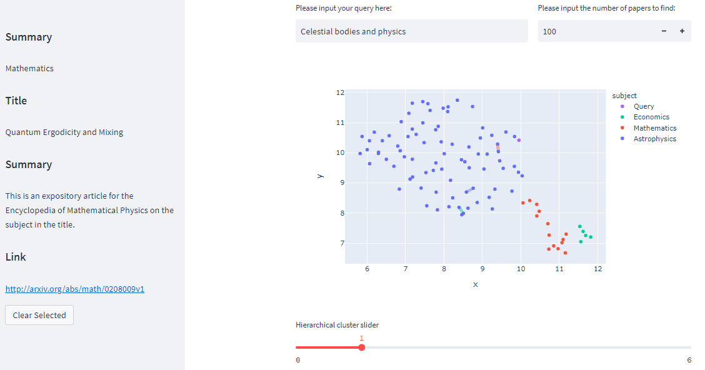

# Research Paper Semantic Search and Clustering

##  Collaborators

- [Sacha Gunaratne](https://www.linkedin.com/in/sachagunaratne/)

##  Background

[arXiv](https://arxiv.org/) is an open access archive for over 2 million scholarly articles in various fields. They offer an endpoint to retrieves abstracts of research papers with specific parameters.

Large language models (LLM) are advanced AI models made for processing text. They can comprehend the meaning behind text and generate output that resembles human text.

Text embeddings are numerical representations of the semantic content of text. For example, the text "I was walking my dog" can be represented as [0.3, ... , 0.5]. These vectors usually have dimensions ranging from 1000 to 4000.

[Cohere](https://cohere.ai/) is an organization offering LLMs as a service. They provide endpoints to embed, classify and generate text.

UMAP (Uniform Manifold Approximation and Projection) is a dimensionality reduction technique used in data visualization and machine learning. It is used to reduce high-dimensional data into a lower dimensional space while preserving the essential structures of the data.

Hierarchical clustering is a method of cluster analysis in machine learning, which seeks to build a hierarchy of clusters. The goal of hierarchical clustering is to partition a set of data points into groups (clusters) based on their similarity.

##  Problem Statement

This project won first prize in an [AI Transformers hackathon](https://lablab.ai/event/transforming-with-transformers) hosted by [LabLabAI](https://lablab.ai/), out of over 1000 participants.

Researchers generally find new papers by looking at the related research sections and references. The problem is that this could easily lead to getting stuck in a local cluster of research. Also in the case where a researcher might be trying to solve a difficult problem with novel research it might be hard to find applicable concepts.

Our goal was to help researchers and students find relevant research using a semantic search and clustering approach. This could potentially help with finding research concepts that are used in other fields.

##  Implementation

We collected 500 abstracts of 5 subjects from [arXiv](https://arxiv.org/)'s API. The abstracts were converting to embeddings using [Cohere](https://cohere.ai/)'s embedding endpoint.

We reduced the dimensions of the embeddings using UMAP and plotted them on a 2-D plot.

We conducted a hierarchical clustering analysis on the plotted points, analyzing the word frequency within each cluster. The user was given the option to determine the number of clusters to display, enabling identification of the clusters and understanding of their meaning.

##  Links

- [Video](https://lablab.ai/event/transforming-with-transformers/hummingbirds/Research%2520Paper%2520Clustering)
- [Demo](https://kael558-redesigned-spoon-ui-em33xz.streamlit.app/)
- [Repository](https://github.com/kael558/redesigned-spoon)
