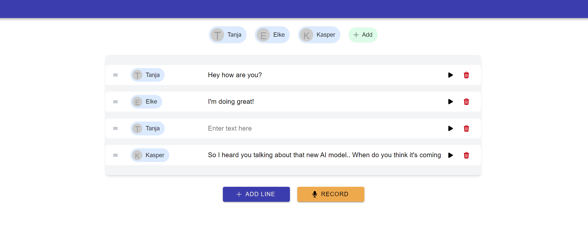

# ScriptableAI: Revolutionizing Audio Content Creation

## Background

ScriptableAI is an innovative web-based platform designed to simplify and enhance the process of creating audio content. Built with advanced AI capabilities, it allows content creators, podcasters, and audio enthusiasts to easily generate high-quality, multi-voice audio scripts with customizable settings and features. ScriptableAI is inspired by the growing demand for accessible, flexible, and affordable audio production tools in the rapidly expanding digital content landscape.

## Problem Statement

Traditional audio content creation often involves complex software, expensive voice actors, or limited text-to-speech options. Existing solutions either lack flexibility, require significant technical expertise, or come with prohibitive subscription costs. Many content creators need a simple, cost-effective way to produce professional-sounding audio without long-term financial commitments.

Popular platforms like [Murf](https://murf.ai/) and [WellSaid Labs](https://wellsaidlabs.com/), while offering quality services, operate on subscription models costing $19.99/month and $44/month respectively. These fixed monthly fees can be a significant barrier for occasional users or those with fluctuating content production needs. A usage-based pricing model better aligns with the varied demands of content creators, potentially leading to higher conversion rates and greater user satisfaction.

ScriptableAI addresses these issues by providing an intuitive, web-based platform that combines advanced AI voice technology with user-friendly features. It allows creators to generate, edit, and export high-quality audio content on a pay-per-use basis, making it accessible to both occasional users and frequent content producers. This flexible approach ensures users only pay for what they need, when they need it, without the pressure of ongoing subscription costs.

## Solution

<Audio>scriptable-ai/intro.mp3</Audio>

ScriptableAI offers a comprehensive web interface that simplifies the audio content creation process. Users can easily create scripts, assign voices to characters, add sound effects and music, and even transcribe their own voice into text for further editing. The platform integrates seamlessly with popular AI voice services, providing a wide range of natural-sounding voices to choose from.

This tool not only streamlines the audio production process but also introduces a new level of accessibility and creativity to audio content creation, making it valuable for both experienced podcasters and novice content creators.

## Features

### Multi-Character Voice Assignment
Users can easily assign different AI voices from [Elevenlabs](https://elevenlabs.io/) and [Microsoft Speech Services](https://azure.microsoft.com/en-gb/products/ai-services/ai-speech/) to various characters in their scripts, creating dynamic and engaging audio content.

### Customizable Audio Settings
Fine-tune voice parameters, add pauses, incorporate sound effects, and include background music to create the perfect audio atmosphere.

### Export to MP3
Quickly export your finished audio projects to MP3 format for easy sharing and distribution.

### Script Creation and Sharing
Create, play, and share scripts within the platform, fostering collaboration and creativity.

### Voice Comparison Tool
Compare different AI voices side-by-side to choose the perfect voice for each character or project.

### Speech-to-Script Functionality
Easily create scripts by speaking and switching between characters, with AI transcription converting your voice to text.

### Video Sync (Beta)
Sync your audio with video files for a complete multimedia experience (no video editing capabilities included).

## How It Works

ScriptableAI operates as a web application that integrates with various AI voice services. Users interact with an intuitive interface to create and edit scripts, assign voices, and add audio elements. The platform processes these inputs, generates the audio content using AI technology, and allows for real-time previews and adjustments before final export.

## Timeline
<Timeline>
- 2024-08-01 to 2024-08-15: Core platform development
- 2024-08-15 to 2024-08-25: Integration of AI voice services and audio features
- 2024-08-25 to 2024-09-01: Testing, debugging, and user interface refinement
- 2024-09-01 to 2024-09-31: Pivot to Video voice-over sync feature
- 2024-10-01: Public launch
</Timeline>

## Business Case

ScriptableAI fills a unique niche in the audio content creation market by offering a flexible, affordable, and user-friendly solution. It caters to a wide range of users, from individual content creators to small businesses, who need professional-quality audio without the overhead of traditional production methods or the commitment of monthly subscriptions.

### Market

- **Content Creators**: YouTubers, podcasters, and social media influencers looking for easy ways to produce high-quality audio content.
- **Small Businesses**: Companies needing voice-overs for promotional videos or training materials without the expense of professional voice actors.
- **Educators**: Teachers and trainers creating engaging audio content for e-learning platforms.
- **Hobbyists**: Individuals interested in creating audio dramas, storytelling, or personal projects.

### Pricing Strategy

ScriptableAI adopts a usage-based pricing model, allowing users to pay only for what they use. This approach provides flexibility and affordability compared to subscription-based competitors:

- Pay-per-minute of generated audio
- Discounted rates for bulk purchases
- Free tier with limited features to attract new users

## Go-to-Market Strategy

### General Strategies
1. Launch on ProductHunt to gain initial traction
2. Leverage social media platforms (LinkedIn, TikTok, Reddit) for organic reach
3. Create and distribute a viral meme video showcasing the product's capabilities