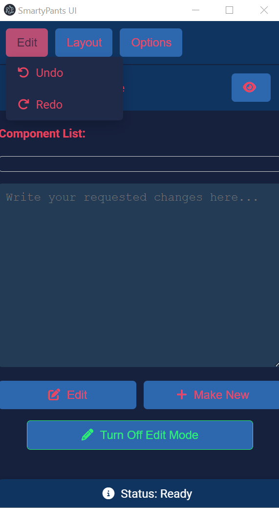
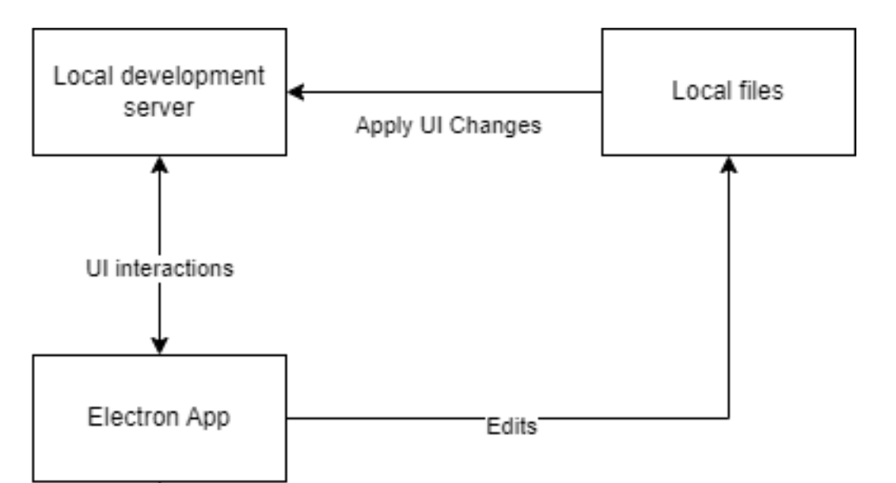

# SmartyPants UI: Revolutionizing Front-End Development

## Background

SmartyPants UI is an innovative front-end development tool designed to dramatically accelerate and simplify the process of creating and customizing web applications. Built with advanced AI capabilities, it allows developers to directly interact with UI elements to view and modify their corresponding source code, something that has never been done before. SmartyPants UI is inspired by the challenges developers face in balancing customizability and efficiency in web development. By integrating an intelligent, AI-driven environment, it streamlines the entire front-end development process, making it faster, more intuitive, and accessible to developers of all skill levels.

## Problem Statement

Traditional front-end development is often a time-consuming and tedious process, requiring developers to switch between a code editor and a web browser to see changes reflected in real-time. Existing tools either sacrifice customizability for ease of use, like website builders, or require extensive manual coding, which can be slow and prone to errors. Additionally, there is no solution that effectively integrates these processes, leaving developers to juggle multiple tools and workflows.

SmartyPants UI addresses these issues by providing an all-in-one development environment that bridges the gap between ease of use and customizability. It allows developers to click on UI elements to see and edit the underlying React code directly, and uses AI to automate tasks such as creating new components or modifying existing ones. This not only speeds up the development process but also reduces the potential for errors and increases productivity.

## Solution

SmartyPants UI offers a cutting-edge development environment that overlays on top of your existing React projects. It features a floating window that lets you hover over and click on UI elements to instantly access and modify the associated source code. With AI integration, you can perform complex tasks using natural language commands, such as generating new components or altering existing ones without writing any code manually.

<video src="../projects/smartypants-ui/demo.mp4"></video>

This tool not only simplifies the development process but also introduces a new way of interacting with and editing web applications, making it a valuable asset for both experienced developers and those with limited coding skills.

## Features

### Click-to-Source Code
SmartyPants UI introduces an innovative feature where clicking on any UI element instantly reveals the corresponding React code, allowing for quick and precise edits.

### AI-Powered Component Creation
Using natural language commands, developers can generate new components or modify existing ones without manual coding, significantly reducing development time.

### Responsive Design Testing
Easily switch between different device views—mobile, tablet, and desktop—to ensure that your application is fully responsive and optimized for all screen sizes.

### Seamless Integration
SmartyPants UI integrates smoothly with existing development processes and tools, allowing developers to incorporate it into their current workflows with minimal disruption.

## How It Works

SmartyPants UI operates as an Electron application that overlays on your local development server. It interacts with the UI elements rendered in your browser, enabling direct code manipulation through an intuitive interface. The application communicates with various generation endpoints responsible for code, name, and CSS generation, and utilizes a vector database to store and retrieve this information. This allows for real-time updates and seamless transitions between different components and views.

## Timeline
<Timeline>
- 2024-07-14: Initial development of the integrated environment for [LabLabAI Hackathon](https://lablab.ai/event/langflow-hackathon/smartypants-ui/smarty-pants-ui)
- 2024-07-20 to 2024-09-01: Development of features and improvements
- 2024-09-01 to 2024-09-20: Integration of authentication, payments, and additional features
- 2024-09-20 to 2024-10-01: Testing and debugging
- 2024-10-01: Launch of SmartyPants UI
</Timeline>

## Business Case

SmartyPants UI fills a unique niche in the front-end development market by offering a development process that does not exist anywhere else. It caters to both seasoned developers looking to speed up their workflows and non-technical users seeking to create custom web applications without extensive coding knowledge. The tool is designed to be easily integrated into existing development processes, providing a flexible and powerful solution for front-end development.

### Market

- **Emerging Developers**: A growing market of users with limited technical skills who need intuitive tools to build custom web applications.
- **Experienced Developers**: Professionals looking to accelerate their development process and reduce manual coding.
- **Companies**: Organizations aiming to streamline their front-end development workflows and enhance productivity.

SmartyPants UI is poised to transform the front-end development landscape by making advanced tools accessible to a broader audience while providing unparalleled efficiency and customization options.