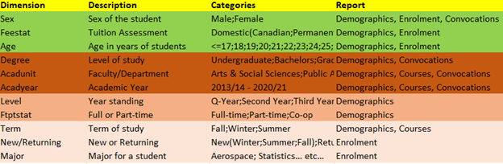
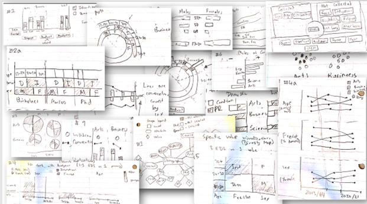
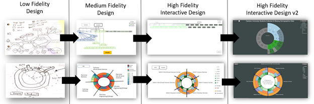

# Visualizing Diversity in Data

##  Team
<People>
[
  {
    "name": "Fateme Rajabiyazdi",
    "role": "Supervisor",
    "job": "Assistant Professor at Carleton University",
    "socials": {
      "personal website": "https://fatemerajabiyazdi.github.io//"
    }
  },
  {
    "name": "Gananatha Subrahmanyam",
    "role": "EDI Research Specialist",
    "job": "Professor at University of Ottawa"
  }
]
</People>

##  Problem Statement

Tracking diversity statistics can help universities to identify areas where they may need to improve in terms of recruiting, admitting, and retaining diverse students. Having proper tools to understand the data can assist Universities as they work to effect policy changes in relation to diversity, equity and inclusion.

The Carleton Original Data Cubes (CODC) contain information about the demographics of students. The diversity statistics include student counts by sex, age, and citizenship status. These may be compared against categories, including degrees, departments, STEM vs non-STEM, academic years, study status and/or the majors of students. Visualizing this data could patterns, trends or anomalies.

The primary goal was to design an interactive visualization on a web-based platform. It allows graphical comparison of student diversity in various academic categories. The secondary goal was to show the lack of demographic diversity data collected by the University.

##  Implementation

In phase one, I created low to medium-fidelity visualizations and collaborated with an EDI research specialist to discuss missing attributes and improve designs. Finally, I cleaned the CODC data using Python.

For the complete Design Rationale, see the GitHub repo readme.

In phase two, I implemented the designs using an interactive web-based platform and the d3 library.

We communicated with the Carleton Institutional Research & Planning Team about potential issues with the dataset, contributing to a complete system overhaul. We presented our project to them and suggested important demographic categories to collect.

We also wrote a [paper](EDI_Visualization_Design.pdf) detailing our project, for the Visualizing for Social Good workshop. Despite not being accepted, I gained valuable feedback for future paper submissions.

##  Links

- [Project page](https://kael558.github.io/EDIProjectPage/)
- [Repository](https://github.com/kael558/symmetrical-dollop)
- [Visualization](https://kael558.github.io/symmetrical-dollop/)
- [Paper Download](visualizing-diversity/EDI_Visualization_Design.pdf)
